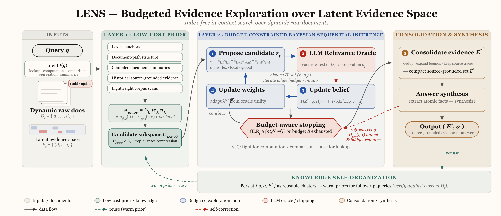
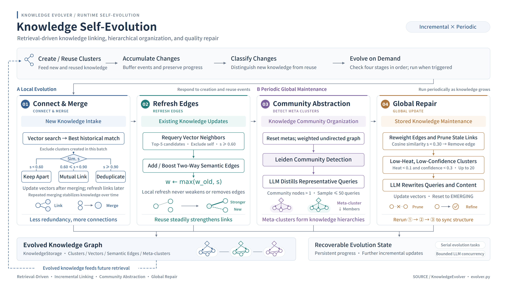

Sirchmunk's architecture is organized into cleanly separated layers, following the principle of **Separation of Concerns**.

## System Overview



## LENS Framework


**LENS** (Latent Evidence Exploration and Search) is an index-free retrieval framework that formulates in-context search as **Budgeted Evidence Localization** over a latent evidence space induced by dynamic raw documents. Instead of pre-materializing evidence via embedding indexes or chunk stores, LENS maintains a query-conditioned belief over candidate evidence units and iteratively:

1. **Proposes** candidates via complementary lexical, local, and exploratory proposal policies
2. **Updates** the belief via an LLM relevance oracle
3. **Narrows** toward high-posterior regions under a controllable token budget

This formulation makes the search process adaptive, budget-aware, and fully grounded in source documents — without any pre-built index infrastructure.

> **Paper:** [LENS: In-Context Search via Latent Evidence Exploration over Dynamic Raw Documents](https://arxiv.org/abs/2608.16185) (arXiv 2026)

## Knowledge Graph


The **Knowledge Graph** provides an interactive visualization of self-evolving knowledge clusters built incrementally from search interactions. Powered by Cytoscape.js, it displays:

- **Cluster relationships** — semantic edges linking related knowledge units
- **Lifecycle states** — visual encoding of Emerging → Stable → Deprecated transitions
- **Leiden meta-clustering** — higher-level community structure discovered via the Leiden algorithm

Users can explore, filter, and drill into clusters directly from the Web UI.

See the [Knowledge Evolution showcase](/showcase/knowledge-graph/) for an animated demonstration of how clusters evolve over time.

## Core Components

| Component             | Description                                                              |
|:----------------------|:-------------------------------------------------------------------------|
| **AgenticSearch**     | Search orchestrator with FAST / DEEP / FILENAME_ONLY modes and budget-aware evidence localization |
| **KnowledgeBase**     | Persists source-grounded evidence clusters as reusable warm priors for later queries |
| **EvidenceProcessor** | Consolidates candidate regions into compact, traceable evidence units     |
| **GrepRetriever**     | High-performance _indexless_ file search with parallel processing        |
| **OpenAIChat**        | Unified LLM interface supporting streaming and usage tracking            |
| **KnowledgeCompiler** | Offline document compilation into tree indices and knowledge clusters (Beta) |
| **KnowledgeLint**     | Knowledge health checks and auto-repair                                  |
| **MonitorTracker**    | Real-time system and application metrics collection                      |

## Multi-Phase Search Pipeline

At the heart of Sirchmunk is a multi-phase search pipeline designed around **maximum parallelism within each phase** and **strict phase dependencies** between them.

### Phase 0 — Knowledge Cluster Reuse

Before any computation begins, the system checks whether a semantically similar query has been answered before. A lightweight embedding of the query is compared via cosine similarity against stored knowledge clusters. If a close match is found (above a configurable threshold), the cached cluster is returned immediately — providing **sub-second response times** for repeated or paraphrased queries.

This is not merely a cache — it is the beginning of knowledge *compounding*. Each reuse appends the new query to the cluster's history, so the system remembers which questions led to which insights.

### Phase 1 — Parallel Probing

Multiple independent probes launch concurrently to gather diverse signals:

1. **LLM Keyword Extraction** — The LLM decomposes the query into multi-level keywords, from coarse (high recall) to fine (high precision), each annotated with an estimated rarity score.
2. **Directory Structure Scan** — The file system is traversed to collect path metadata: file names, sizes, modification times, and content previews — the foundation for *intelligent inference* using structural cues.
3. **Knowledge Cache Lookup** — Partial match search across existing clusters for potential reuse of previously acquired knowledge.
4. **Compile Artifact Load** — Previously computed tree indices, topic maps, and summary indexes are loaded when available.

### Phase 2 — Multi-Path DEEP Retrieval

In v0.2.0, DEEP mode runs **5 complementary retrieval paths** in parallel:

| Path | Signal |
|:-----|:-------|
| **Lexical** | IDF-weighted keyword search through raw file contents |
| **Entity** | Exact-match entity lookup for named entities and identifiers |
| **Directory** | Structure-based ranking via LLM-guided metadata evaluation |
| **Structural** | Heuristic document tree navigation using compile artifacts |
| **Topic-Graph** | Cross-document topic-map traversal for multi-hop discovery |

Results from all paths are fused via **confidence-weighted Reciprocal Rank Fusion (RRF)**. A **soft route collapse** mechanism dynamically disables low-yield paths — when a single path achieves high confidence with strong margin, the remaining paths are collapsed to cut latency and tokens while preserving answer quality.

### Phase 3 — Evidence Localization & Cluster Construction

Results are merged, deduplicated, and processed through budgeted evidence localization. The LLM synthesizes evidence fragments into structured Knowledge Clusters.

### Phase 4 — Summarization or ReAct Refinement

- **Evidence found** → LLM generates a structured briefing with source-linked evidence
- **No evidence** → ReAct agent activates for iterative exploration with hop-aware strategies

### Phase 5 — Persist

Valuable clusters are saved with their embeddings for future reuse.

## Key Algorithms

### Budgeted Evidence Exploration

Traditional retrieval systems read entire documents or rely on fixed-size chunks, leading to either wasted tokens or lost context. LENS instead treats the relevant evidence as **latent and query-conditioned**: the system first forms a low-cost prior over likely evidence regions, then spends LLM calls only where observations are most useful.


The workflow has three layers:

1. **Low-cost prior:** Lexical anchors, document-path structure, compiled summaries, historical source-grounded evidence, and lightweight corpus scans narrow the candidate subspace before expensive oracle calls.

2. **Budget-constrained sequential inference:** Candidate regions are proposed, observed by an LLM relevance oracle, and used to update the belief state until the budget-aware stopping rule says the evidence is sufficient.

3. **Consolidation and synthesis:** Selected regions are merged into a compact source-grounded evidence set, synthesized into an answer, and optionally persisted as reusable knowledge for follow-up queries.

**Key properties:**

- **Index-free over raw documents:** Search can run directly over dynamic files without pre-materializing a persistent embedding or chunk index.
- **Source-grounded:** The final answer is paired with traceable evidence regions instead of opaque vector hits.
- **Budget-aware:** LLM calls are spent adaptively on uncertain or high-value evidence regions, with explicit telemetry for cost and latency.

### ReAct Agent

An autonomous Think → Act → Observe loop with:

- Prioritized tool strategy (keyword search → file read → knowledge query → directory scan)
- Dual-budget mechanism (token budget + loop count)
- Memory of previously explored avenues

## Self-Evolving Knowledge Clusters

Sirchmunk does not discard search results after answering a query. Instead, every search produces a **KnowledgeCluster** — a structured, reusable knowledge unit that grows smarter over time. This is what makes the system _self-evolving_.

### What is a KnowledgeCluster?

A KnowledgeCluster is a richly annotated object that captures the full cognitive output of a single search cycle:

| Field | Purpose |
|:------|:--------|
| **Evidences** | Source-linked evidence regions localized by LENS, each with file path, summary, and raw text |
| **Content** | LLM-synthesized markdown with structured analysis and references |
| **Patterns** | 3–5 distilled design principles or mechanisms identified from the evidence |
| **Confidence** | A consensus score \[0, 1\] indicating the reliability of the cluster |
| **Queries** | Historical queries that contributed to or reused this cluster (FIFO, max 5) |
| **Hotness** | Activity score reflecting query frequency and recency |
| **Embedding** | 384-dim vector derived from accumulated queries, enabling semantic retrieval |

### Lifecycle: From Creation to Evolution

```text
 ┌─────── New Query ───────┐
 │                          ▼
 │     ┌──────────────────────────────┐
 │     │  Phase 0: Semantic Reuse     │──── Match found ──→ Return cached cluster
 │     │  (cosine similarity ≥ 0.85)  │                     + update hotness/queries/embedding
 │     └──────────┬───────────────────┘
 │           No match
 │                ▼
 │     ┌──────────────────────────────┐
 │     │  Phase 1–3: Full Search      │
 │     │  (keywords → retrieval →     │
 │     │   evidence localization →   │
 │     └──────────┬───────────────────┘
 │                ▼
 │     ┌──────────────────────────────┐
 │     │  Build New Cluster           │
 │     │  Deterministic ID: C{sha256} │
 │     └──────────┬───────────────────┘
 │                ▼
 │     ┌──────────────────────────────┐
 │     │  Phase 5: Persist            │
 │     │  Embed queries → DuckDB →    │
 │     │  Parquet (atomic sync)       │
 └─────└──────────────────────────────┘
```

1. **Reuse Check (Phase 0):** Before any retrieval, the query is embedded and compared against all stored clusters via cosine similarity. If a high-confidence match is found, the existing cluster is returned instantly — saving LLM tokens and search time entirely.

2. **Creation (Phase 1–3):** When no reuse match is found, the full pipeline runs: keyword extraction, file retrieval, budgeted evidence localization, and LLM synthesis produce a new `KnowledgeCluster`.

3. **Persistence (Phase 5):** The cluster is stored in an in-memory DuckDB table and periodically flushed to Parquet files. Atomic writes and mtime-based reload ensure multi-process safety.

4. **Evolution on Reuse:** Each time a cluster is reused, the system:
   - Appends the new query to the cluster's query history (FIFO, max 5)
   - Increases hotness (`+0.1`, capped at 1.0)
   - Recomputes the embedding from the updated query set — broadening the cluster's semantic catchment area
   - Updates version and timestamp

### Key Properties

- **Zero-cost acceleration:** Repeated or semantically similar queries are answered from cached clusters without any LLM inference, making subsequent searches near-instantaneous.
- **Query-driven embeddings:** Cluster embeddings are derived from _queries_ rather than content, ensuring that retrieval aligns with how users actually ask questions — not how documents are written.
- **Semantic broadening:** As diverse queries reuse the same cluster, its embedding drifts to cover a wider semantic neighborhood, naturally improving recall for related future queries.
- **Lightweight persistence:** DuckDB in-memory + Parquet on disk — no external database infrastructure required. Background daemon sync with configurable flush intervals keeps overhead minimal.

#### Knowledge Evolver



Beyond per-query cluster creation and reuse, the `KnowledgeEvolver` runs a four-phase background cycle that maintains the knowledge graph as a whole:

1. **Connect & Merge** — Computes pairwise similarity among buffered clusters. Clusters with similarity ≥ 0.90 are merged; those with similarity ≥ 0.60 gain inter-cluster edges, consolidating fragmented knowledge from related queries.
2. **Refresh Edges** — Re-evaluates existing edges, pruning stale connections and updating weights based on recent co-query patterns and semantic drift.
3. **Detect Meta Clusters** — Leiden community detection (via igraph) discovers higher-order structure — groups of clusters that form coherent knowledge communities representing emergent domain expertise.
4. **Global Update** — Synchronizes lifecycle states across the graph: consistently reinforced clusters graduate from Emerging to Stable; orphaned or contradicted clusters move toward Deprecated.

The entire cycle runs asynchronously, triggered by search activity (buffer counts and step intervals). Results persist to DuckDB + Parquet with an incremental manifest for crash recovery. The evolver never blocks the query hot path.

## Data Storage

All persistent data is stored in the configured `SIRCHMUNK_WORK_PATH` (default: `~/.sirchmunk/`):

```text
{SIRCHMUNK_WORK_PATH}/
  ├── .cache/
    ├── history/              # Chat session history (DuckDB)
    │   └── chat_history.db
    ├── knowledge/            # Knowledge clusters (Parquet)
    │   └── knowledge_clusters.parquet
    ├── compile/              # Compile artifacts (Beta)
    │   ├── manifest.json     # File manifest with hashes
    │   ├── document_catalog.json
    │   ├── summary_index.json
    │   ├── trees/            # Hierarchical tree indices
    │   ├── table_digests/    # Table extraction digests
    │   └── xlsx_digests/     # Spreadsheet digests
    └── settings/             # User settings (DuckDB)
        └── settings.db
```

## Design Principles

Sirchmunk adheres to **SOLID principles**:

- **Single Responsibility** — Each component has one clear purpose
- **Open/Closed** — Extended through abstractions, not modifications
- **Liskov Substitution** — All implementations honor abstract contracts
- **Interface Segregation** — Minimal, focused interfaces
- **Dependency Inversion** — High-level logic depends on abstractions

For a comprehensive technical analysis, read the [Technical Deep Dive](/blog/technical-deep-dive/).

---

> **Paper:** [LENS: In-Context Search via Latent Evidence Exploration over Dynamic Raw Documents](https://arxiv.org/abs/2608.16185) (arXiv 2026)
