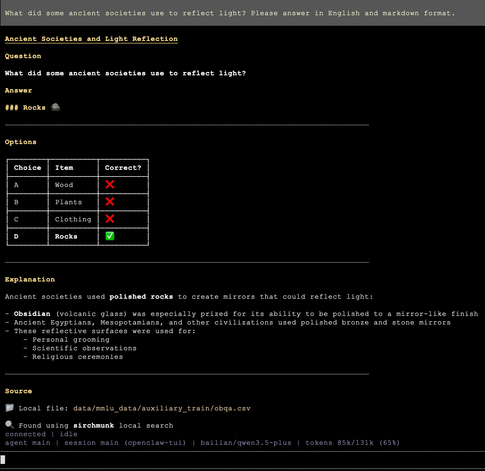

将 [Sirchmunk](https://github.com/modelscope/sirchmunk) 作为 [OpenClaw](https://openclaw.org/) 技能发布，使任何兼容 OpenClaw 的 AI Agent 均可通过自然语言搜索本地文件 — 无需向量数据库、无需预索引、无需 ETL。

**已上架 ClawHub：** <https://clawhub.ai/wangxingjun778/sirchmunk>

## 快速开始

### 1. 安装 Sirchmunk

```bash
pip install sirchmunk
sirchmunk init          # 生成 ~/.sirchmunk/.env
```

编辑 `~/.sirchmunk/.env`，至少设置以下内容：

```dotenv
LLM_API_KEY=sk-...
LLM_BASE_URL=https://api.openai.com/v1   # 或任何 OpenAI 兼容端点
LLM_MODEL_NAME=gpt-4o

# 可选：默认搜索目录（逗号分隔）
SIRCHMUNK_SEARCH_PATHS=/path/to/your/docs,/another/path
```

### 2. 启动 Sirchmunk API 服务器

```bash
sirchmunk serve          # 默认地址：http://0.0.0.0:8584
```

验证服务是否运行：

```bash
curl http://localhost:8584/api/v1/search/status
```

### 3. 在 OpenClaw 中安装技能

从 ClawHub 安装：

```bash
npx clawhub@latest install sirchmunk
```

或者将 [openclaw_skills recipe](https://github.com/modelscope/sirchmunk/tree/main/recipes/openclaw_skills/sirchmunk) 中的 `sirchmunk/` 目录复制到 `~/.openclaw/skills/sirchmunk/`。

### 4. 开始使用

Agent 现在可以调用 `sirchmunk_search` 工具。你也可以直接运行脚本：

```bash
# 使用服务器环境中的 SIRCHMUNK_SEARCH_PATHS 作为默认搜索路径
~/.openclaw/skills/sirchmunk/scripts/sirchmunk_search.sh "What is the reward function?"

# 指定搜索路径
~/.openclaw/skills/sirchmunk/scripts/sirchmunk_search.sh "auth flow" "/path/to/project"
```

## 使用示例

以下截图展示了在 **OpenClaw TUI** (`openclaw-tui`) 中通过 Sirchmunk 技能进行**本地 RAG 检索**的效果：Agent 调用 `sirchmunk` 从本地文件（如 OBQA / 科学问答数据集）中检索匹配内容，然后按所需语言进行总结。

### 英文 — 本地搜索示例

*示例查询：* 询问有关古代社会与光反射的问题；答案基于本地文件（如 `obqa.csv`）生成，并标注"Found using **sirchmunk** local search"。

<div align="center">
  
</div>

### 中文 — 本地检索示例

*示例查询：* 自制冰棍"做好"时温度计应显示的读数；Agent 用 **sirchmunk** 检索本地 CSV（如 `obqa.csv`、`arc_easy.csv` 等），并以中文结构化回答。

<div align="center">
  
</div>

## 工作原理

该技能本质上是一个轻量 HTTP 客户端。被调用时，它向本地 Sirchmunk 服务器发送 `POST` 请求：

```bash
curl -s -X POST "http://localhost:8584/api/v1/search" \
  -H "Content-Type: application/json" \
  -d '{
    "query": "your question",
    "mode": "FAST"
  }'
```

- **`paths`** 可选。省略时，服务器使用环境变量 `SIRCHMUNK_SEARCH_PATHS`，若也未设置则回退到工作目录。
- **`mode`** 可选 `FAST`（默认，2-5 秒）、`DEEP`（全面分析，10-30 秒）或 `FILENAME_ONLY`（无需 LLM）。

完整参数说明、SSE 流式端点和 Python / JavaScript 客户端示例，请参阅 [API 参考]()。

## 技能清单（Skill Manifest）

`sirchmunk/` 目录中的 `SKILL.md` 告诉 OpenClaw 运行时该技能暴露了哪些工具：

```yaml
---
name: sirchmunk
description: Local file search using sirchmunk API. Use when you need to search for files or content by asking natural language questions.
---
```

封装脚本 `sirchmunk_search.sh` 接收 `query` 和可选的 `paths` 参数，转发到 Sirchmunk 服务器，并返回 JSON 结果。

## 文件结构

```
recipes/openclaw_skills/
├── README.md
├── assets/
│   ├── example1.png                # 中文使用截图
│   └── example2.png                # 英文使用截图
└── sirchmunk/
    ├── SKILL.md                    # OpenClaw 技能清单
    └── scripts/
        └── sirchmunk_search.sh     # Agent 调用的封装脚本
```

## 安全须知

- Sirchmunk 服务器默认在**本地运行**并绑定 `localhost`。文件内容会发送到配置的 LLM 端点进行分析。如果使用云端 LLM，请注意搜索内容会离开本机。
- 如果数据安全至关重要，建议使用**本地 LLM**（Ollama、vLLM 等）或通过 `SIRCHMUNK_SEARCH_PATHS` 限制搜索范围到非敏感目录。
- 请勿在未配置额外认证的情况下将 8584 端口暴露给不受信任的网络。

## 相关链接

- [Sirchmunk GitHub](https://github.com/modelscope/sirchmunk)
- [ClawHub 页面](https://clawhub.ai/wangxingjun778/sirchmunk)
- [OpenClaw 官网](https://openclaw.org/)
