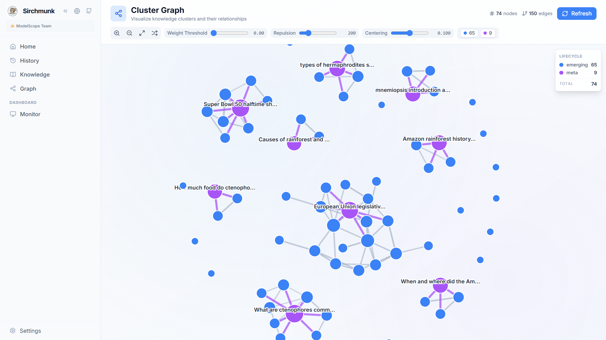

Sirchmunk 的 Web UI 内置了一套交互式知识图谱，可视化展示随搜索交互增量构建的自进化知识聚类。图谱由 [Cytoscape.js](https://js.cytoscape.org/) 驱动，直观呈现聚类之间的语义关联及其生命周期状态 — 从 **Emerging（新兴）** 到 **Stable（稳定）** — 让你实时观察系统智能如何随使用不断增长。

知识聚类持久化于 **DuckDB + Parquet**，通过四阶段运行时周期持续进化：连接合并、边刷新、元聚类发现（基于 Leiden 社区发现算法）与全局重校准。图谱界面支持交互式探索社区结构、按生命周期阶段过滤，并追踪查询如何促成聚类的形成与演化。

